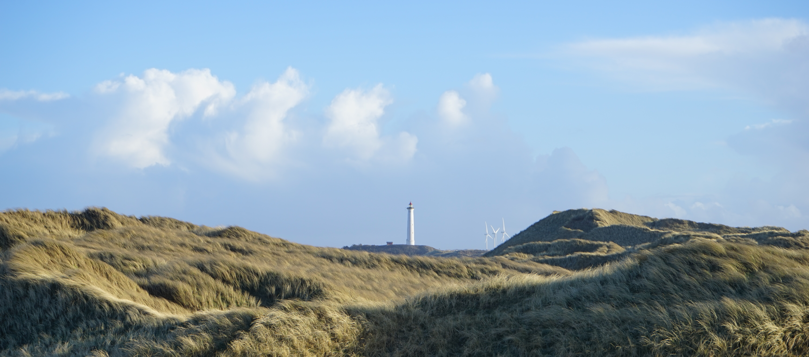

```{r, out.width = "1000px", echo = FALSE, fig.align='center'}

```

You have reached the website of Henrik Schinke. Currently, I am doctoral student at the [university hopsital](https://www.lmu-klinikum.de/) in Munich. My research mainly focuses on signaling pathways and cellular programs of cancer. A great benefit of being affiliated to a hospital is the close proximity to clinical routine. Thus, I focus on investigations which can help improve cancer therapy. And I believe *R* can be a great ally for this purpose. 


Here, I want to publish recent work and projects worth sharing. 


Find out more [about me](https://henrikschinke.github.io/about.html) or [recent ideas](https://henrikschinke.github.io/blog/). If you are interested in uploaded *R*-Scripts, check out my *R* section in the navigation bar or visit my [Github](https://github.com/henrikschinke). 
